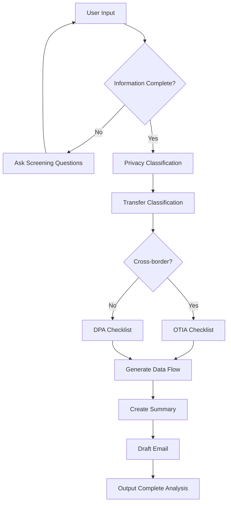
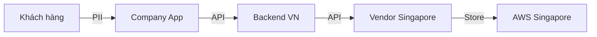

# Data Privacy Intake Agent - Project Documentation

> **AI-Powered Privacy Intake Triage System for Fintech Companies**

**Version:** 2.0.0  
**Status:** Production Ready  
**Built for:** Internal AI Competition Demo

---

## Table of Contents

1. [Executive Summary](#1-executive-summary)
2. [Problem Statement](#2-problem-statement)
3. [Solution Overview](#3-solution-overview)
4. [System Architecture](#4-system-architecture)
5. [Technology Stack](#5-technology-stack)
6. [Features](#6-features)
7. [Project Structure](#7-project-structure)
8. [Database Schema](#8-database-schema)
9. [AI Agent Design](#9-ai-agent-design)
10. [API Reference](#10-api-reference)
11. [Deployment Guide](#11-deployment-guide)
12. [Configuration](#12-configuration)
13. [Security Considerations](#13-security-considerations)
14. [Limitations & Future Roadmap](#14-limitations--future-roadmap)
15. [Glossary](#15-glossary)

---

## 1. Executive Summary

**Data Privacy Intake Agent** là một AI chatbot thông minh được thiết kế để hỗ trợ các team Business/Product tại các công ty fintech trong việc chuẩn bị và phân loại các yêu cầu chia sẻ dữ liệu trước khi gửi đến team Data Privacy review.

### Key Value Propositions

| Stakeholder | Benefit |
|-------------|---------|
| **Business Teams** | Hướng dẫn rõ ràng về thông tin cần cung cấp, giảm thời gian chờ đợi |
| **Data Privacy Team** | Nhận được case đã được phân tích sơ bộ với đầy đủ hồ sơ |
| **Organization** | Tăng tốc quy trình phê duyệt, cải thiện compliance |

### Core Capabilities

- ✅ **Phân loại case tự động** - Domestic vs Cross-border, Personal vs Sensitive data
- ✅ **Phát hiện thông tin thiếu** - Gap analysis với priority
- ✅ **Sinh checklist động** - DPA/OTIA checklist theo loại case
- ✅ **Tạo data flow diagram** - Mermaid diagrams
- ✅ **Executive summary** - Tóm tắt cho reviewer
- ✅ **Draft email** - Email yêu cầu bổ sung thông tin

---

## 2. Problem Statement

### Current Challenges

Tại các công ty fintech, các team Business/Product thường xuyên gửi yêu cầu Data Privacy review cho:
- Data Processing Agreements (DPA) với vendors
- Chia sẻ dữ liệu với partners
- Chuyển dữ liệu xuyên biên giới
- Onboarding vendors mới

**Pain Points:**

```
┌─────────────────────────────────────────────────────────────┐
│                    CURRENT WORKFLOW                         │
├─────────────────────────────────────────────────────────────┤
│  Biz Team          →    Incomplete Request                  │
│  Privacy Team      ←    Request More Info                   │
│  Biz Team          →    Partial Update                      │
│  Privacy Team      ←    Still Missing Items                 │
│  ...               ...   (Multiple iterations)              │
│  Privacy Team      →    Finally Complete Review             │
├─────────────────────────────────────────────────────────────┤
│  Result: Delays, bottlenecks, frustrated teams              │
└─────────────────────────────────────────────────────────────┘
```

### Quantified Impact

| Issue | Impact |
|-------|--------|
| Incomplete requests | 70%+ requests thiếu thông tin quan trọng |
| Back-and-forth communications | 3-5 lần trao đổi/request |
| Processing time | 2-4 tuần cho mỗi request |
| Privacy team bottleneck | 40%+ thời gian dành cho triage cơ bản |

---

## 3. Solution Overview

### Proposed Workflow

```
┌─────────────────────────────────────────────────────────────┐
│                    NEW WORKFLOW WITH AI AGENT               │
├─────────────────────────────────────────────────────────────┤
│  Biz Team          →    Submit to AI Agent                  │
│  AI Agent          →    Analyze & Classify                  │
│  AI Agent          →    Identify Gaps                       │
│  AI Agent          →    Generate Checklist + Summary        │
│  Biz Team          →    Complete Request (First Time!)      │
│  Privacy Team      →    Review Pre-analyzed Case            │
├─────────────────────────────────────────────────────────────┤
│  Result: Faster, complete submissions, efficient reviews    │
└─────────────────────────────────────────────────────────────┘
```

### Agent Workflow



---

## 4. System Architecture

### High-Level Architecture

```
┌─────────────────────────────────────────────────────────────────┐
│                         User Layer                               │
│                    (Biz/Product Teams)                           │
└────────────────────────┬────────────────────────────────────────┘
                         │
                         ▼
┌─────────────────────────────────────────────────────────────────┐
│                    Frontend (Streamlit)                          │
│  ┌─────────────────┐  ┌─────────────────┐  ┌─────────────────┐  │
│  │   Chat UI       │  │  Session Mgmt   │  │  Export Tools   │  │
│  │   + Demo Cases  │  │  (Create/Load)  │  │  (Excel/MD)     │  │
│  └─────────────────┘  └─────────────────┘  └─────────────────┘  │
│                              Port: 8501                          │
└────────────────────────┬────────────────────────────────────────┘
                         │ HTTP/REST
                         ▼
┌─────────────────────────────────────────────────────────────────┐
│                    Backend (FastAPI)                             │
│  ┌─────────────────┐  ┌─────────────────┐  ┌─────────────────┐  │
│  │  API Endpoints  │  │  Agent Service  │  │  Auth Module    │  │
│  │  /chat, /config │  │  LLM Integration│  │  JWT + bcrypt   │  │
│  └─────────────────┘  └─────────────────┘  └─────────────────┘  │
│  ┌─────────────────┐  ┌─────────────────┐  ┌─────────────────┐  │
│  │  Knowledge Base │  │  Skills Engine  │  │  Rules Engine   │  │
│  │  (Markdown)     │  │  (7 Skills)     │  │  (DB-driven)    │  │
│  └─────────────────┘  └─────────────────┘  └─────────────────┘  │
│                              Port: 8000/8080                     │
└────────────────────────┬────────────────────────────────────────┘
                         │
           ┌─────────────┴─────────────┐
           │                           │
           ▼                           ▼
┌─────────────────────┐    ┌─────────────────────┐
│    PostgreSQL       │    │    LLM API          │
│    Database         │    │    (OpenAI/Qwen)    │
│  - Sessions         │    │  - Chat completion  │
│  - Rules/Checklists │    │  - gpt-4o-mini      │
│  - Settings         │    │  - qwen3-5-27b      │
│  - Audit logs       │    │                     │
│       Port: 5432    │    │                     │
└─────────────────────┘    └─────────────────────┘
```

### Component Interaction Flow

```
┌──────────┐    ┌──────────┐    ┌──────────┐    ┌──────────┐
│ Frontend │───▶│ Backend  │───▶│ Agent    │───▶│ LLM API  │
│          │    │ API      │    │ Service  │    │          │
└──────────┘    └──────────┘    └──────────┘    └──────────┘
                     │               │
                     ▼               ▼
              ┌──────────┐    ┌──────────────┐
              │ Database │    │ Knowledge    │
              │ (Rules,  │    │ Base + Skills│
              │ Sessions)│    │ (Markdown)   │
              └──────────┘    └──────────────┘
```

---

## 5. Technology Stack

### Backend

| Component | Technology | Version | Purpose |
|-----------|------------|---------|---------|
| Framework | FastAPI | 0.104.1 | REST API |
| Runtime | Python | 3.11+ | Backend logic |
| ORM | SQLAlchemy | 2.0.23 | Database operations |
| HTTP Client | httpx | 0.25.1 | LLM API calls |
| Authentication | python-jose | 3.3.0 | JWT tokens |
| Password Hashing | passlib + bcrypt | 1.7.4 | Secure auth |
| Database Driver | asyncpg | 0.29.0 | Async PostgreSQL |
| Migration | Alembic | 1.13.0 | Schema migrations |

### Frontend

| Component | Technology | Version | Purpose |
|-----------|------------|---------|---------|
| Framework | Streamlit | 1.31.0+ | Web UI |
| HTTP Client | requests | 2.31.0+ | API calls |
| Excel Export | openpyxl | 3.1.2+ | Export functionality |
| Data Processing | pandas | 2.1.3+ | Data manipulation |

### Infrastructure

| Component | Technology | Version | Purpose |
|-----------|------------|---------|---------|
| Database | PostgreSQL | 15-alpine | Data persistence |
| Containerization | Docker | 3.8+ compose | Deployment |
| LLM Provider | OpenAI / VNG Cloud | - | AI inference |

### Supported LLM Models

| Model | Provider | Use Case |
|-------|----------|----------|
| `gpt-4o-mini` | OpenAI | Default, balanced |
| `gpt-4` | OpenAI | High quality |
| `qwen/qwen3-5-27b` | VNG Cloud | Cost-effective |
| `openai/gpt-5` | VNG Cloud | Advanced reasoning |

---

## 6. Features

### 6.1 Core Chat Features

#### Multi-turn Conversation
- Hỗ trợ hội thoại nhiều lượt
- Context được duy trì xuyên suốt session
- Có thể hỏi follow-up questions

#### Session Management
- Tạo, lưu, load chat sessions
- Xem lịch sử conversations
- Delete sessions không cần thiết

#### Demo Cases
3 sample cases được tích hợp sẵn:
1. **No Personal Data** - Aggregated reporting (low risk)
2. **Domestic Sharing** - Customer support vendor (medium risk)
3. **Cross-Border Transfer** - Singapore credit scoring (high risk)

### 6.2 AI Analysis Capabilities

#### Case Classification
| Classification | Description |
|----------------|-------------|
| Personal Data Detection | Identifies PII (names, phones, emails, IDs) |
| Sensitive Data Detection | Financial, health, biometric data |
| Transfer Type | Domestic vs Cross-border |
| Risk Level | Low / Medium / High |

#### Information Gap Analysis
- Identifies missing critical information
- Asks targeted screening questions
- Prioritizes gaps by importance

#### Document Generation
| Document | Format | Purpose |
|----------|--------|---------|
| Classification Table | Markdown table | Quick overview |
| Checklist | Dynamic from DB | Required documents |
| Data Flow Diagram | Mermaid | Visual representation |
| Executive Summary | Text | For reviewers |
| Follow-up Email | Text | Request missing info |

### 6.3 Admin Panel Features

#### Rules Management (Database-driven)
- **Checklist Items**: DPA và OTIA checklist items
- **Screening Questions**: Câu hỏi sàng lọc
- **Sensitive Keywords**: Keywords để detect sensitive data
- **Form Links**: Dynamic intake form URLs

#### Knowledge Base Management
- Edit system prompt
- Update privacy rules
- Modify skill instructions

#### Settings
- Model selection
- Custom instructions
- Company configuration

### 6.4 Export Features

| Format | Content | Use Case |
|--------|---------|----------|
| Excel (.xlsx) | Classification + Checklist | Formal submission |
| Markdown (.md) | Full analysis | Documentation |

---

## 7. Project Structure

```
data-privacy-intake-agent/
│
├── backend/                          # FastAPI Backend
│   ├── main.py                       # Application entry point
│   ├── agent_service.py              # LLM integration & agent logic
│   ├── database.py                   # Database connection & setup
│   ├── models.py                     # SQLAlchemy models
│   ├── crud.py                       # CRUD operations (sessions, settings)
│   ├── crud_rules.py                 # CRUD operations (rules)
│   ├── auth.py                       # Authentication utilities
│   ├── dependencies.py               # FastAPI dependencies
│   ├── requirements.txt              # Python dependencies
│   ├── Dockerfile                    # Backend container
│   │
│   ├── routers/                      # API Routers
│   │   ├── auth.py                   # Auth endpoints
│   │   └── rules.py                  # Rules CRUD endpoints
│   │
│   ├── schemas/                      # Pydantic schemas
│   │   └── rules.py                  # Rules schemas
│   │
│   ├── prompts/
│   │   └── system_prompt.md          # Main system prompt (320 lines)
│   │
│   ├── knowledge/
│   │   ├── privacy_rules.md          # Privacy definitions & rules
│   │   ├── dpa_checklist.md          # Domestic checklist template
│   │   └── otia_checklist.md         # Cross-border checklist template
│   │
│   ├── skills/                       # Agent skills (7 total)
│   │   ├── intake_skill.md           # Information extraction
│   │   ├── privacy_classification_skill.md
│   │   ├── transfer_classification_skill.md
│   │   ├── checklist_generation_skill.md
│   │   ├── data_flow_generation_skill.md
│   │   ├── privacy_summary_skill.md
│   │   └── email_generation_skill.md
│   │
│   ├── examples/
│   │   └── sample_cases.md           # 3 demo cases
│   │
│   └── scripts/
│       └── migrate_rules.py          # DB migration script
│
├── frontend/                         # Streamlit Frontend
│   ├── app.py                        # Main chat interface
│   ├── auth_helper.py                # Auth utilities
│   ├── requirements.txt              # Python dependencies
│   ├── Dockerfile                    # Frontend container
│   │
│   ├── pages/
│   │   └── 1_⚙️_Admin_Panel.py       # Admin configuration page
│   │
│   └── .streamlit/
│       ├── config.toml               # Streamlit config
│       └── secrets.toml.example      # Secrets template
│
├── docker-compose.yml                # Multi-container orchestration
├── .env                              # Environment variables
├── .env.example                      # Env template
│
└── Documentation Files
    ├── README.md                     # Main README
    ├── QUICK_START.md                # Quick start guide
    ├── ADMIN_PANEL_GUIDE.md          # Admin panel documentation
    ├── CUSTOMIZABLE_RULES_GUIDE.md   # Rules customization guide
    ├── DEPLOYMENT_CHECKLIST.md       # Deployment checklist
    ├── IMPLEMENTATION_SUMMARY.md     # Implementation notes
    ├── POSTGRES_MIGRATION.md         # Database migration guide
    └── UPGRADE_GUIDE.md              # Version upgrade guide
```

**Total Files:** ~40 files  
**Lines of Code:** ~5,000+ lines

---

## 8. Database Schema

### Entity Relationship Diagram

```
┌─────────────────┐       ┌─────────────────┐
│     users       │       │    sessions     │
├─────────────────┤       ├─────────────────┤
│ id (PK)         │       │ id (PK)         │
│ username        │       │ name            │
│ password_hash   │       │ messages (JSON) │
│ is_active       │       │ created_at      │
│ created_at      │       │ updated_at      │
│ updated_at      │       └─────────────────┘
└────────┬────────┘
         │
         │ FK
         ▼
┌─────────────────────────────────────────────────────────┐
│                    checklist_items                       │
├─────────────────────────────────────────────────────────┤
│ id (PK)           │ category (ENUM: DPA/OTIA/GENERAL)   │
│ item_number       │ title                                │
│ description       │ required_documents                   │
│ notes             │ is_active                            │
│ display_order     │ created_by (FK → users)              │
│ created_at        │ updated_at                           │
└─────────────────────────────────────────────────────────┘

┌─────────────────────────────────────────────────────────┐
│                  screening_questions                     │
├─────────────────────────────────────────────────────────┤
│ id (PK)           │ question_text                        │
│ question_type     │ options                              │
│ (yes_no/multi/    │ is_active                            │
│  text)            │ display_order                        │
│ created_at        │ updated_at                           │
└─────────────────────────────────────────────────────────┘

┌─────────────────────────────────────────────────────────┐
│                   sensitive_keywords                     │
├─────────────────────────────────────────────────────────┤
│ id (PK)           │ keyword                              │
│ category          │ description                          │
│ is_active         │ created_at                           │
│ updated_at        │                                      │
└─────────────────────────────────────────────────────────┘

┌─────────────────────────────────────────────────────────┐
│                   intake_form_links                      │
├─────────────────────────────────────────────────────────┤
│ id (PK)           │ name                                 │
│ url               │ description                          │
│ category (ENUM:   │ conditions                           │
│ DOMESTIC/         │ is_active                            │
│ CROSS_BORDER/     │ display_order                        │
│ GENERAL)          │ created_by (FK → users)              │
│ created_at        │ updated_at                           │
└─────────────────────────────────────────────────────────┘

┌─────────────────────────────────────────────────────────┐
│                    rule_audit_logs                       │
├─────────────────────────────────────────────────────────┤
│ id (PK)           │ table_name                           │
│ record_id         │ action (CREATE/UPDATE/DELETE)        │
│ old_value (JSON)  │ new_value (JSON)                     │
│ changed_by (FK)   │ changed_at                           │
└─────────────────────────────────────────────────────────┘

┌─────────────────────────────────────────────────────────┐
│                      settings                            │
├─────────────────────────────────────────────────────────┤
│ id (PK)           │ key (UNIQUE)                         │
│ value             │ created_at                           │
│ updated_at        │                                      │
└─────────────────────────────────────────────────────────┘

┌─────────────────────────────────────────────────────────┐
│                    agent_configs                         │
├─────────────────────────────────────────────────────────┤
│ id (PK)           │ config_data (JSON)                   │
│ created_at        │ updated_at                           │
└─────────────────────────────────────────────────────────┘
```

### Enums

```python
class ChecklistCategory(Enum):
    DPA = "DPA"           # Domestic Processing Agreement
    OTIA = "OTIA"         # Offshore Transfer Impact Assessment
    GENERAL = "GENERAL"   # General use

class FormLinkCategory(Enum):
    DOMESTIC = "DOMESTIC"
    CROSS_BORDER = "CROSS_BORDER"
    GENERAL = "GENERAL"

class QuestionType(Enum):
    YES_NO = "yes_no"
    MULTIPLE_CHOICE = "multiple_choice"
    TEXT = "text"

class AuditAction(Enum):
    CREATE = "CREATE"
    UPDATE = "UPDATE"
    DELETE = "DELETE"
```

---

## 9. AI Agent Design

### 9.1 System Prompt Architecture

Agent được cấu hình với một system prompt toàn diện (~320 lines) bao gồm:

```
┌─────────────────────────────────────────────────────────┐
│                    SYSTEM PROMPT                         │
├─────────────────────────────────────────────────────────┤
│  1. Role Definition                                      │
│     - Privacy Intake Triage Agent                        │
│     - NOT a legal advisor                                │
│                                                          │
│  2. Core Principles                                      │
│     - You MUST / You MUST NOT rules                      │
│                                                          │
│  3. Screening Question Groups (3 groups)                 │
│     - Data Sharing?                                      │
│     - What Data?                                         │
│     - How Processed?                                     │
│                                                          │
│  4. Result Categories (3 types)                          │
│     - No personal data                                   │
│     - Domestic sharing                                   │
│     - Cross-border transfer                              │
│                                                          │
│  5. Classification Rules                                 │
│     - Personal data recognition                          │
│     - Sensitive data recognition                         │
│     - Cross-border recognition                           │
│                                                          │
│  6. Output Format (Sections A-H)                         │
│     - Classification Table                               │
│     - Reasoning                                          │
│     - Missing Information                                │
│     - Checklist                                          │
│     - Form Links                                         │
│     - Data Flow Diagram                                  │
│     - Summary                                            │
│     - Disclaimer                                         │
│                                                          │
│  7. Behavior Rules                                       │
│     - When to ask questions                              │
│     - When to provide full analysis                      │
│                                                          │
│  8. Edge Cases Handling                                  │
└─────────────────────────────────────────────────────────┘
```

### 9.2 Knowledge Base

```
┌─────────────────────────────────────────────────────────┐
│                    KNOWLEDGE BASE                        │
├─────────────────────────────────────────────────────────┤
│  privacy_rules.md (~340 lines)                          │
│  ├── What is Personal Data?                              │
│  ├── What is Sensitive Personal Data?                    │
│  ├── Data Classification Rules (5 rules)                 │
│  ├── Cross-Border Transfer Rules (5 rules)               │
│  ├── Human Review Requirements                           │
│  ├── Consent & Notice Requirements                       │
│  ├── Data Retention Rules                                │
│  ├── Security Requirements                               │
│  ├── Third-Party Processing                              │
│  ├── Common Mistakes                                     │
│  └── Decision Tree                                       │
│                                                          │
│  dpa_checklist.md                                        │
│  └── Domestic Processing Agreement checklist             │
│                                                          │
│  otia_checklist.md                                       │
│  └── Offshore Transfer Impact Assessment checklist       │
└─────────────────────────────────────────────────────────┘
```

### 9.3 Skills (7 Specialized Instructions)

| Skill | File | Purpose |
|-------|------|---------|
| Intake | `intake_skill.md` | Extract information from user input |
| Privacy Classification | `privacy_classification_skill.md` | Classify personal/sensitive data |
| Transfer Classification | `transfer_classification_skill.md` | Determine domestic vs cross-border |
| Checklist Generation | `checklist_generation_skill.md` | Generate appropriate checklist |
| Data Flow Generation | `data_flow_generation_skill.md` | Create Mermaid diagrams |
| Privacy Summary | `privacy_summary_skill.md` | Write executive summary |
| Email Generation | `email_generation_skill.md` | Draft follow-up emails |

### 9.4 Prompt Assembly

```python
# Runtime prompt construction
full_prompt = (
    system_prompt           # Base instructions
    + knowledge_base        # Privacy rules, checklists (from DB or files)
    + skills                # 7 skill instructions
    + dynamic_config        # Company name, form links, custom instructions
)
```

### 9.5 LLM Integration

```python
# Supports multiple endpoints
if model.startswith("openai/"):
    # VNG Cloud /responses endpoint
    endpoint = f"{base_url}/responses"
    payload = {
        "model": model,
        "input": messages,
        "max_output_tokens": 4000,
        "reasoning": {"effort": "medium"}
    }
else:
    # Standard OpenAI /chat/completions
    endpoint = f"{base_url}/chat/completions"
    payload = {
        "model": model,
        "messages": messages,
        "temperature": 0.7,
        "max_tokens": 4096
    }
```

---

## 10. API Reference

### Base URL

- **Local/Docker:** `http://localhost:8000`
- **Production:** Configure via `BACKEND_URL`

### Authentication

Currently uses simple JWT authentication for admin endpoints.

```
Authorization: Bearer <token>
```

### Endpoints

#### Health Check

```http
GET /health
```

**Response:**
```json
{
  "status": "ok",
  "version": "2.0.0",
  "database": "postgresql"
}
```

#### Chat (Main Analysis Endpoint)

```http
POST /chat
```

**Request:**
```json
{
  "message": "Team tôi muốn chia sẻ dữ liệu...",
  "conversation_history": [
    {"role": "user", "content": "Previous message"},
    {"role": "assistant", "content": "Previous response"}
  ]
}
```

**Response:**
```json
{
  "answer": "# Kết Quả Phân Tích Case\n\n## A. Bảng Phân Loại..."
}
```

#### Sessions

```http
GET    /sessions              # List all sessions
POST   /sessions              # Create new session
GET    /sessions/{id}         # Get session by ID
PUT    /sessions/{id}         # Update session
DELETE /sessions/{id}         # Delete session
```

#### Settings

```http
GET /settings                 # Get all settings
PUT /settings                 # Update settings
```

#### Configuration

```http
GET /config                   # Get agent config
PUT /config                   # Update agent config
```

#### Knowledge Base

```http
GET    /knowledge             # List all knowledge files
GET    /knowledge/{filename}  # Get file content
PUT    /knowledge/{filename}  # Update file content
```

#### System Prompt

```http
GET /system-prompt            # Get current prompt
PUT /system-prompt            # Update prompt
```

#### Rules (Admin)

```http
# Checklist Items
GET    /rules/checklist-items
POST   /rules/checklist-items
PUT    /rules/checklist-items/{id}
DELETE /rules/checklist-items/{id}

# Screening Questions
GET    /rules/screening-questions
POST   /rules/screening-questions
PUT    /rules/screening-questions/{id}
DELETE /rules/screening-questions/{id}

# Sensitive Keywords
GET    /rules/sensitive-keywords
POST   /rules/sensitive-keywords
PUT    /rules/sensitive-keywords/{id}
DELETE /rules/sensitive-keywords/{id}

# Form Links
GET    /rules/form-links
POST   /rules/form-links
PUT    /rules/form-links/{id}
DELETE /rules/form-links/{id}
```

#### Authentication

```http
POST /auth/login              # Login
POST /auth/register           # Register (admin only)
GET  /auth/me                 # Get current user
```

---

## 11. Deployment Guide

### Prerequisites

- Docker Desktop / Docker Engine
- Docker Compose v2.0+
- (Optional) OpenAI API key or compatible LLM API

### Quick Start with Docker

```bash
# 1. Navigate to project
cd data-privacy-intake-agent

# 2. Create environment file
cp .env.example .env

# 3. Edit .env with your settings
# LLM_API_KEY=your-api-key
# JWT_SECRET_KEY=your-secret-key

# 4. Start all services
docker-compose up -d

# 5. Verify services
docker-compose ps

# 6. Access application
# Frontend: http://localhost:8501
# Backend:  http://localhost:8000
# Health:   http://localhost:8000/health
```

### Service Ports

| Service | Internal Port | External Port |
|---------|---------------|---------------|
| PostgreSQL | 5432 | 5432 |
| Backend | 8080 | 8000 |
| Frontend | 8501 | 8501 |

### Docker Compose Services

```yaml
services:
  postgres:     # Database
  backend:      # FastAPI API
  frontend:     # Streamlit UI
```

### Common Operations

```bash
# View logs
docker-compose logs -f backend
docker-compose logs -f frontend

# Restart services
docker-compose restart

# Stop services
docker-compose down

# Rebuild after code changes
docker-compose up -d --build

# Access database
docker exec -it privacy-agent-postgres psql -U privacy_agent -d privacy_agent_db
```

---

## 12. Configuration

### Environment Variables

#### Backend (.env)

| Variable | Description | Default | Required |
|----------|-------------|---------|----------|
| `LLM_API_KEY` | OpenAI or compatible API key | - | No* |
| `LLM_BASE_URL` | LLM API base URL | `https://api.openai.com/v1` | No |
| `LLM_MODEL` | Default model | `qwen/qwen3-5-27b` | No |
| `DATABASE_URL` | PostgreSQL connection string | - | Yes |
| `JWT_SECRET_KEY` | Secret for JWT tokens | - | Yes |
| `ACCESS_TOKEN_EXPIRE_MINUTES` | Token expiry | 1440 | No |

*Without API key, app uses mock responses.

#### Frontend

| Variable | Description | Default |
|----------|-------------|---------|
| `BACKEND_URL` | Backend API URL | `http://localhost:8000` |

### Changing LLM Model

Via environment:
```bash
LLM_MODEL=gpt-4
```

Via Admin Panel:
1. Go to Admin Panel → Settings
2. Select model from dropdown
3. Save changes

### Using Alternative LLM Providers

```bash
# For VNG Cloud
LLM_BASE_URL=https://vngcloud.ai/v1
LLM_API_KEY=your-vng-api-key
LLM_MODEL=qwen/qwen3-5-27b

# For Azure OpenAI
LLM_BASE_URL=https://your-resource.openai.azure.com
LLM_API_KEY=your-azure-key
LLM_MODEL=your-deployment-name
```

---

## 13. Security Considerations

### Current Security Features

| Feature | Implementation |
|---------|----------------|
| Password Hashing | bcrypt with salt |
| JWT Tokens | python-jose with HS256 |
| CORS | Configurable origins |
| Input Validation | Pydantic schemas |
| SQL Injection | SQLAlchemy ORM |
| Audit Logging | Rule changes tracked |

### Recommendations for Production

1. **API Security**
   - Enable CORS restrictions
   - Add rate limiting
   - Use HTTPS

2. **Authentication**
   - Implement OAuth/SSO
   - Add MFA for admin

3. **Data Security**
   - Encrypt sensitive data at rest
   - Rotate JWT secrets regularly
   - Secure database credentials

4. **Infrastructure**
   - Use private networks
   - Enable firewall rules
   - Regular security scanning

### Data Privacy

- No customer PII is stored permanently
- Chat sessions can be deleted
- Audit logs for compliance

---

## 14. Limitations & Future Roadmap

### Current Limitations

| Category | Limitation |
|----------|------------|
| **Storage** | No long-term case tracking |
| **RAG** | No vector database / semantic search |
| **Workflow** | No approval workflow |
| **Integration** | No email/Jira/Slack integration |
| **Analytics** | No usage metrics dashboard |
| **Scale** | Single-instance deployment |

### Roadmap

#### Phase 2: Enhanced Persistence
- [ ] Case history tracking
- [ ] Search and retrieval
- [ ] Status tracking

#### Phase 3: RAG Implementation
- [ ] Vector database (Pinecone/Weaviate)
- [ ] Similar case retrieval
- [ ] Learn from historical decisions

#### Phase 4: Integrations
- [ ] Email sending (SMTP)
- [ ] Jira ticket creation
- [ ] Slack notifications
- [ ] SharePoint integration

#### Phase 5: Workflow
- [ ] Human approval workflow
- [ ] Reviewer assignment
- [ ] SLA monitoring
- [ ] Escalation rules

#### Phase 6: Advanced Features
- [ ] Document parsing (PDF)
- [ ] Contract clause extraction
- [ ] Auto DPA generation
- [ ] Risk scoring model

#### Phase 7: Enterprise
- [ ] SSO/OAuth integration
- [ ] RBAC
- [ ] Multi-tenant support
- [ ] ISO 27001 compliance

---

## 15. Glossary

| Term | Definition |
|------|------------|
| **DPA** | Data Processing Agreement - Thỏa thuận xử lý dữ liệu cá nhân |
| **OTIA** | Offshore Transfer Impact Assessment - Đánh giá tác động chuyển dữ liệu ra nước ngoài |
| **PII** | Personally Identifiable Information - Thông tin định danh cá nhân |
| **MVP** | Minimum Viable Product |
| **LLM** | Large Language Model |
| **RAG** | Retrieval-Augmented Generation |
| **Biz/PO** | Business / Product Owner teams |
| **Cross-border** | Data transfer outside Vietnam |
| **Domestic** | Data sharing within Vietnam |
| **Sensitive data** | Financial, health, biometric, children's data |

---

## Appendix A: Sample API Calls

### Using cURL

```bash
# Health check
curl http://localhost:8000/health

# Analyze a case
curl -X POST http://localhost:8000/chat \
  -H "Content-Type: application/json" \
  -d '{
    "message": "Team tôi muốn chia sẻ email và phone của khách hàng cho vendor tại Singapore để làm marketing.",
    "conversation_history": []
  }'

# List sessions
curl http://localhost:8000/sessions

# Create session
curl -X POST http://localhost:8000/sessions \
  -H "Content-Type: application/json" \
  -d '{"name": "New Chat"}'
```

### Using Python

```python
import requests

# Analyze case
response = requests.post(
    "http://localhost:8000/chat",
    json={
        "message": "Team tôi muốn chia sẻ dữ liệu...",
        "conversation_history": []
    },
    timeout=120
)

result = response.json()
print(result["answer"])
```

---

## Appendix B: Output Format Reference

### Section A: Classification Table

```markdown
| Câu hỏi | Kết quả sơ bộ |
|---------|---------------|
| Có chia sẻ dữ liệu cho đối tác không? | Có |
| Có dữ liệu cá nhân không? | Có (email, phone, user_id) |
| Có dữ liệu cá nhân nhạy cảm không? | Có (transaction history) |
| Chia sẻ trong nước hay ngoài nước? | Ngoài nước (Singapore) |
| Cần Data Privacy review không? | Có |
| Cần Legal/DPA review không? | Có |
| Cần Security review không? | Có |
| Cần xem xét OTIA không? | Có |
```

### Section F: Data Flow Diagram



---

**Document Version:** 1.0  
**Last Updated:** June 2026  
**Author:** AI Competition Team

---

*End of Documentation*
