# Data Flow Generation Skill: Creating Data Flow Diagrams

## Purpose
Generate clear, accurate Mermaid flowchart diagrams that visualize how personal data flows from users to various systems and parties.

## Why Data Flows Matter
A visual data flow helps:
- **Data Privacy team** understand the architecture quickly
- **Business team** see the full picture of data movement
- **Reviewers** identify potential privacy risks
- **Everyone** communicate about the case more effectively

## Your Task
Create a Mermaid flowchart that shows:
1. Where data originates (data subjects/users)
2. Company systems that collect/process data
3. Internal data flows
4. External parties who receive data
5. Geographic boundaries (especially for cross-border cases)

## Mermaid Flowchart Basics

### Basic Syntax
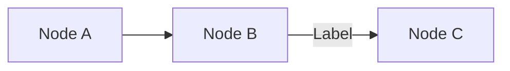

### Node Types to Use
- `[Square brackets]` - Standard process/system box
- `{Diamond}` - Decision point (rarely needed for data flows)
- `((Circle))` - Start/end point (use for data subjects)

### Arrow Types
- `-->` - Solid arrow (actual data flow)
- `-.->` - Dotted arrow (potential or conditional flow)
- `-->|Label|` - Arrow with label (describe what data flows)

### Direction
- `flowchart LR` - Left to right (recommended for most cases)
- `flowchart TD` - Top to bottom (use if many vertical layers)

## Standard Data Flow Components

### 1. Data Subject / User (Origin)
Always start with where data comes from:

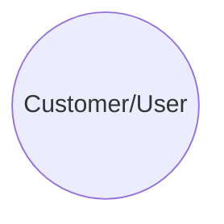

Use different names based on context:
- `Customer((Customer))` - For B2C cases
- `User((App User))` - For app-based services
- `Borrower((Loan Applicant))` - For specific user types
- `Employee((Employee))` - For internal data

### 2. Company's Customer-Facing Systems
Where data is collected:

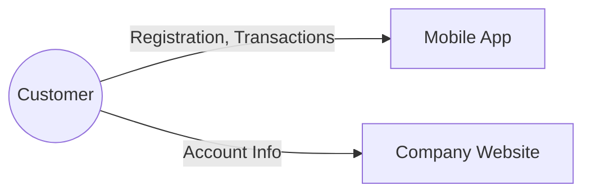

Examples:
- `[Mobile App]`
- `[Web Portal]`
- `[Customer Service]`
- `[Point of Sale]`

### 3. Company's Backend Systems
Internal processing:

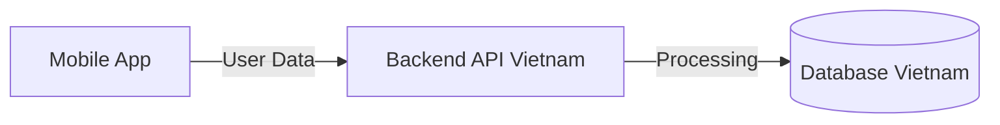

Examples:
- `[Backend API]`
- `[Application Server]`
- `[(Database)]` - Use database symbol
- `[Analytics Engine]`
- `[CRM System]`

### 4. External Partners/Vendors
Third parties who receive data:

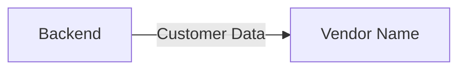

**Important:** If vendor is outside Vietnam, show the country!

### 5. Geographic Boundaries (Cross-Border)
For cross-border cases, show where data crosses borders:

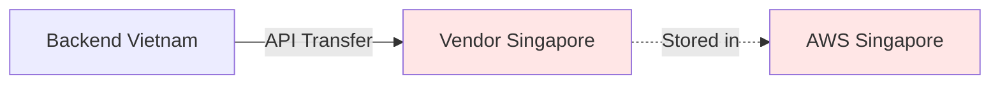

Use light red/pink styling for foreign systems.

## Data Flow Templates

### Template 1: Domestic Data Sharing

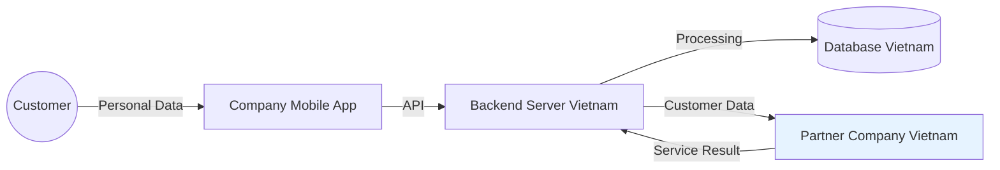

**When to use:** Sharing data with domestic partner/vendor

### Template 2: Cross-Border Transfer

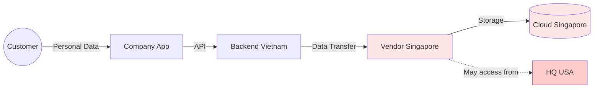

**When to use:** Data leaves Vietnam

### Template 3: Cloud Service Usage

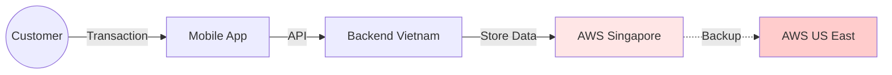

**When to use:** Using foreign cloud infrastructure

### Template 4: Multi-Party Sharing

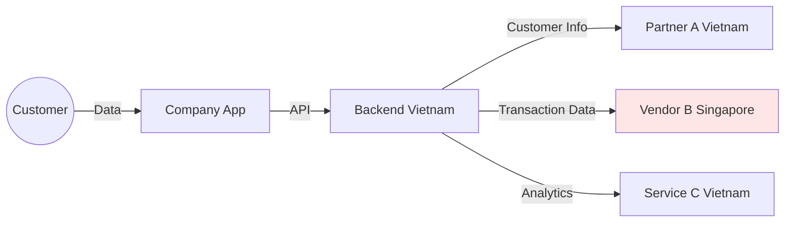

**When to use:** Sharing with multiple parties

### Template 5: API Integration

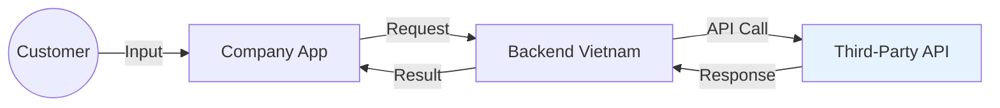

**When to use:** Real-time API integrations

## Customization Guidelines

### Step 1: Identify All Parties
List all systems and parties involved:
- Data subject (user)
- Company frontend (app/web)
- Company backend
- Company database
- Partner/vendor 1
- Partner/vendor 2 (if any)
- Sub-processors (if any)

### Step 2: Identify Data Flows
For each connection, note:
- What data flows (be specific if possible)
- Direction of flow
- Whether it's cross-border

### Step 3: Arrange Logically
Order from left to right (or top to bottom):
1. Data subject
2. Collection point
3. Internal processing
4. External sharing
5. Storage/final destination

### Step 4: Add Labels
Label arrows with what data flows:
- `|Personal Data|` - Generic
- `|Name, Email, Phone|` - Specific fields
- `|Transaction History|` - Data category
- `|API Request|` - Technical method

### Step 5: Highlight Cross-Border
Use styling for anything outside Vietnam:
```
style NodeName fill:#ffe6e6
```

### Step 6: Add Context Nodes (Optional)
If helpful, add nodes for:
- Countries: `[Country: Singapore]`
- Purposes: `[For: Credit Scoring]`
- Security: `[Encrypted TLS]`

## Examples Based on Case Types

### Example 1: No Personal Data Case
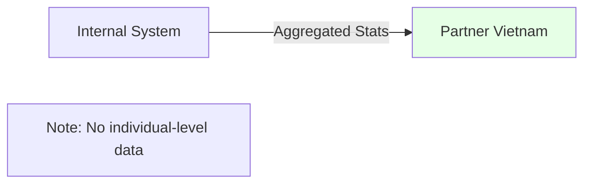

### Example 2: Domestic Vendor for Customer Support
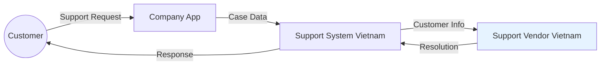

### Example 3: Cross-Border SaaS Platform
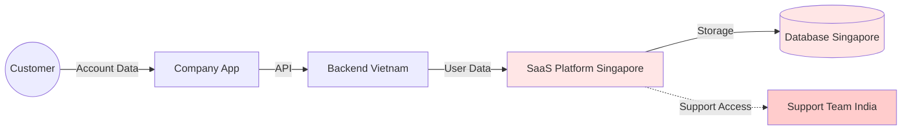

### Example 4: Multiple Countries
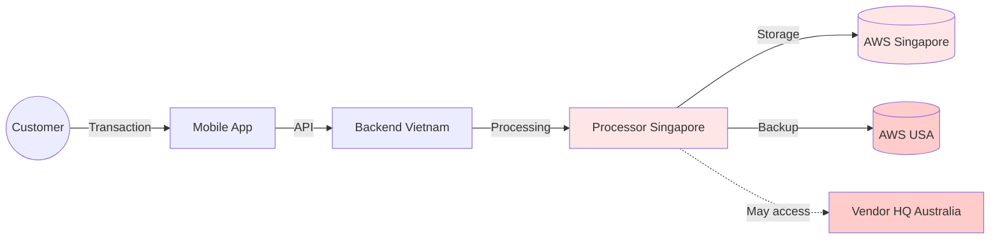

## What to Include in Labels

### Good Label Examples
- `|Name, Phone, Email|` - Specific data fields
- `|Transaction History|` - Data category
- `|Customer Profile|` - Logical grouping
- `|Encrypted API|` - Technical detail
- `|For Credit Scoring|` - Purpose

### Bad Label Examples (Too Vague)
- `|Data|` - Too generic
- `|Info|` - Not helpful
- `|API|` - Doesn't say what data

## Common Mistakes to Avoid

❌ **Too complicated:** Don't include every technical detail
✅ **Keep it simple:** Show main data flows only

❌ **Missing geography:** Not showing where systems are located
✅ **Show locations:** Especially for cross-border cases

❌ **No labels:** Arrows with no description
✅ **Label flows:** Say what data moves

❌ **Wrong direction:** Arrows pointing the wrong way
✅ **Correct flow:** Follow actual data movement

❌ **Missing parties:** Forgetting sub-processors or access points
✅ **Complete picture:** Include all parties who touch data

## Styling Guide

### For Domestic Systems
```
style NodeName fill:#e6f3ff
```
(Light blue - domestic)

### For Foreign Systems (Cross-Border)
```
style NodeName fill:#ffe6e6
```
(Light red - foreign, medium risk)

### For High-Risk Foreign Systems
```
style NodeName fill:#ffcccc
```
(Darker red - high risk countries)

### For Secure/Good Systems
```
style NodeName fill:#e6ffe6
```
(Light green - positive/secure)

## When Information is Incomplete

If you don't have full information, still create a diagram but:

1. **Use placeholder names:**
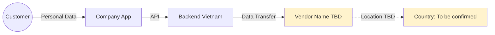

2. **Use dotted lines for unclear flows:**
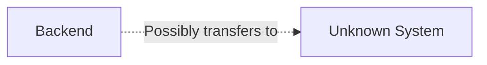

3. **Add notes:**
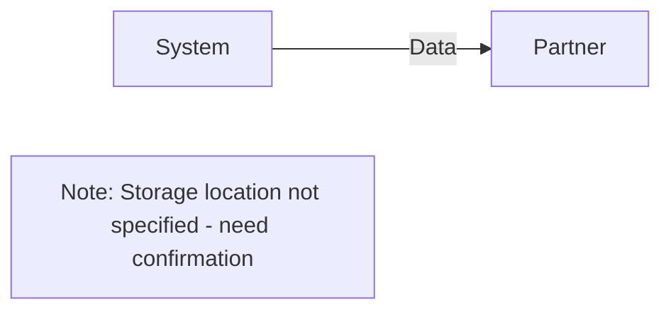

## Output Format for This Skill

```markdown
### DRAFT DATA FLOW DIAGRAM

#### Diagram

```mermaid
[Your flowchart here]
```

#### Diagram Explanation

**Data Flow Description:**
1. [Describe first step: e.g., "Customer provides personal data via mobile app"]
2. [Describe second step: e.g., "App sends data to company backend in Vietnam"]
3. [Continue for all major steps]
4. [Highlight cross-border transfer: e.g., "Backend transfers data to vendor in Singapore"]

**Key Components:**
- **Data Subject:** [Who - customers, users, etc.]
- **Collection Point:** [Where data enters - app, website, etc.]
- **Internal Systems:** [Company systems - backend, database]
- **External Parties:** [Vendors, partners and their locations]
- **Cross-Border Elements:** [If applicable, which data crosses borders and to where]

**Geographic Scope:**
- Domestic (Vietnam): [List systems]
- Foreign: [List systems and countries]

#### Limitations and Assumptions

**Based on available information:**
- [What you're confident about]

**Assumptions made:**
- [What you assumed due to missing info]

**Need confirmation:**
- [What details need clarification to make diagram more accurate]

```

## Integration with Other Skills

- **Use Intake results:** Base diagram on extracted information
- **Align with Classification:** Diagram should reflect domestic vs cross-border classification
- **Support Checklist:** Diagram helps visualize why certain documents are needed
- **Inform Summary:** Summary should reference the data flow

---

Remember: A good data flow diagram tells a story. Anyone should be able to look at it and understand where personal data goes.
